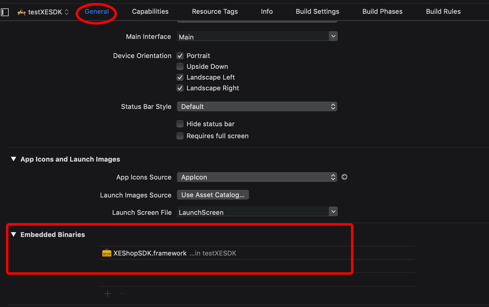
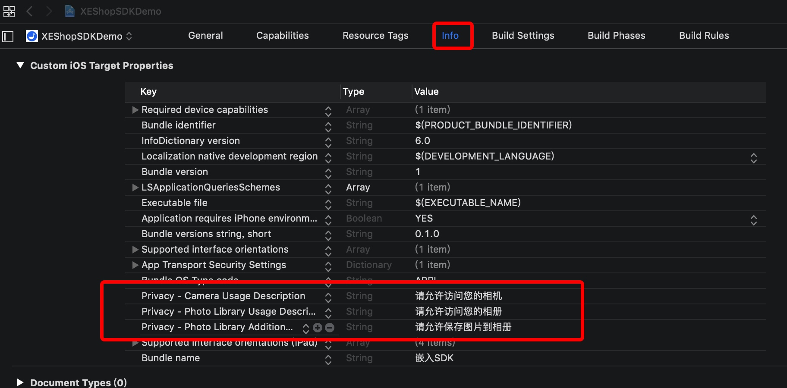
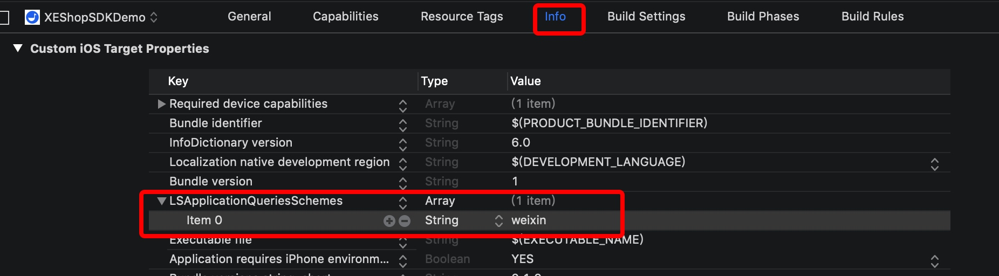
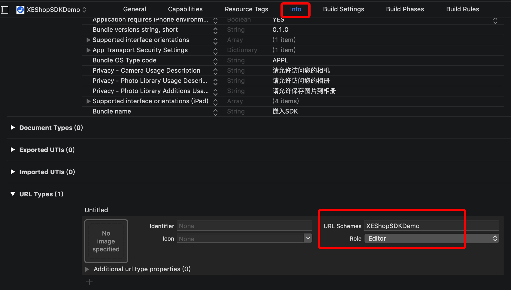

# iOS 版接入指南


## 1. 简述

小鹅通 App SDK 是为移动端应用打造的在线店铺交易系统，通过一个 SDK 便可以在 App 内集成小鹅通提供的整个店铺服务，实现静默登录, 跳转支付等功能来实现 App 端的交易闭环。

## 2. 接入

### 2.1 接入要求
- iOS 9.0 或更高
- Xcode 9.0 或更高版本（建议使用最新版本）

### 2.2 接入流程

#### 2.2.1 引入 framework

XEShopSDK.framework 加入到工程
将对应的 framework 添加到 Embedded Binaries 中



##### 2.2.2 配置 Info.plist 中的权限

- 设置 Photo Privacy (用户更改头像)


- 设置 Schemes (付款需要用户打开微信)



#### 2.2.3 配置 app scheme（微信支付完成后跳转回App）



然后通过 XEConfig 将 scheme 传递给 SDK。

⚠️只有配置了 Scheme, 并正确调用 SDK 的对应方法，微信支付完成后才能正确跳转回到你的 app 中。


## 3. 使用

小鹅通 SDK 依托于 XEWebView 来进行页面展示. 类似 UIWebView, 传入店铺页面地址，就可以进行完整的商品展示购买流程。具体可参考 DEMO。

### 3.1 初始化 SDK

使用 SDK 前需要先初始化。

```Objective-C
// 生成一个配置对象 clientId 从小鹅通申请的 sdk 应用 Id，appId 从小鹅通申请的店铺 Id
XEConfig *config = [[XEConfig alloc] initWithClientId:clientId appId: APPID]
config.scheme = SCHEME; // 配置 scheme 以便微信支付完成后跳转
config.enableLog = NO; // 关闭 sdk 的 log 输出
[XESDK.shared initializeSDKWithConfig:conf]; // 使用配置初始化 SDK
```

### 3.2 界面展示

使用 XEWebView 来展示店铺界面

```Objective-C
...
// 初始化 XEWebView，纯代码或者 Storyboard
self.webView.noticeDelegate = self; // 实现代理方法，监听相关的通知

// 加载链接
[self.webView loadRequest:urlRequest];
```

### 3.3 登录态同步

当遇到需要登陆才可以访问的页面时，会触发下面的回调，此时去获取登录态信息，并同步给 SDK。


```Objective-C
#pragma mark - XEWebViewNoticeDelegate

- (void)webView:(XEWebView *)webView didReceiveNotice:(XENotice *)notice
{

    switch (notice.type) {
        case XENoticeTypeLogin: // 收到登陆请求
        {
            // 这里应该调用登陆接口，获取到cookie_key, cookie_value,
            // 并通过 -synchronizeCookieKey:cookieValue: 同步至SDK
            break;
        }
        case XENoticeTypeShare: // 收到分享的回调数据
        {
            // 在这里自定义分享操作
            break;
        }
        case XENoticeTypeReady: // Web页面已准备好，可以调用分享接口
        {
            // 这里可以启用分享按钮
            break;
        }
        default:
            break;
    }
}
```

### 3.4 认证

#### 3.4.1 同步认证信息

登录后获取认证信息。
同步给 SDK 的方法如下：

```Objective-C
- (void)synchronizeCookieKey:(nullable NSString *)key
                   cookieValue:(nullable NSString *)value;
```

#### 3.4.2 清除认证信息

在三方 App 内发生用户切换或用户退出的时, 为了避免出现客户信息混乱, 请务必执行如下代码登出小鹅通用户角色.

代码示例:

```Objective-C
- (void)logout;
```
### 3.5 页面分享

如需要获取页面的分享信息, 需要调用 XEWebView 的 `-share `方法来触发分享事件：

```Objective-C
- (void)share;
```

触发分享操作后， XEWebView 会异步调用 `webView:didReceiveNotice:` 代理方法，XENotice 的 response 会包含分享需要的各种信息。

并不是所有可见页面都能触发分享. 没有回调则代表该页面不可分享。

### 3.6 日志开关

SDK 提供了日志功能，默认日志为关闭状态. 开发者可以通过 XEConfig 中的设置打开日志开关.

```Objective-C
// 是否开启控制台日志输出，默认为NO。仅在 DEBUG 模式下有效
@property (nonatomic, assign) BOOL enableLog; 
```

## 4. 常见问题

1. 分享回调没有图片等数据？
答： 需在B端后台开通配置
